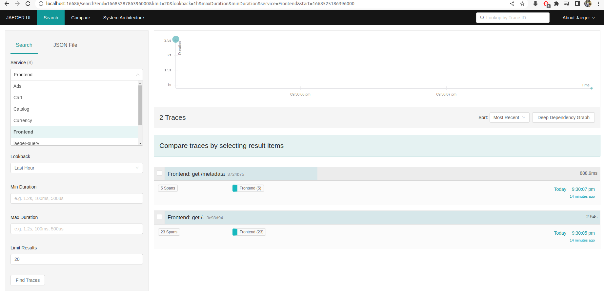
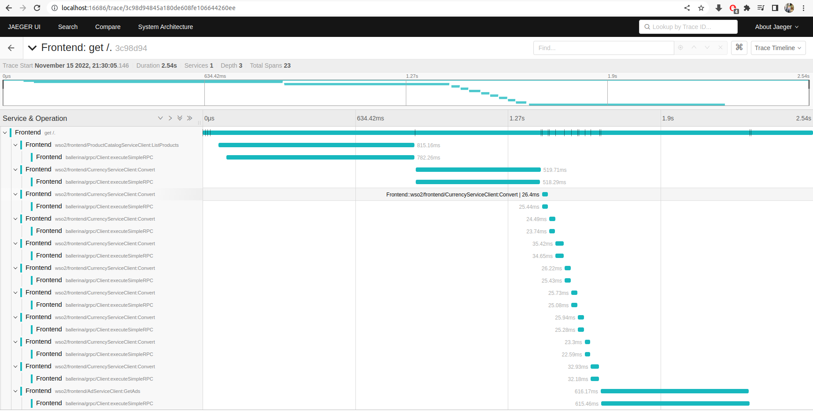

# Introduction
The <a href="https://github.com/GoogleCloudPlatform/microservices-demo" target="_blank">online boutique</a> is a cloud-native microservices demo application written by the Google cloud platform. It consists of a 10-tier microservices application. The application is a web-based e-commerce app using which users can browse items, add them to the cart, and purchase them. The microservices in the GCP demo are implemented using multiple programming languages such as Java, C#, Go, Javascript and Python.      

Here, in this demo these microservices are written using [Ballerina language](https://ballerina.io/) to demonstrate the language features, showcase best practices when writing microservices, provide an in-depth understanding of how ballerina services can interact in a real-world scenario and highlight the support of Ballerina to deploy services natively in the cloud. In our implementation, communication between the microservices is handled using gRPC and the frontend is exposed via an HTTP service.

# Architecture


And also following is the automatically generated Ballerina design view of the demo application.


# Microservices description

| Service name                                   | Description |
|------------------------------------------------|-------------|
| [Frontend](frontend)                           | Exposes an HTTP server to outside to serve data required for the React app. Acts as a frontend for all the backend microservices and abstracts the functionality.|
| [CartService](cartservice)                     | Stores the product items added to the cart and retrieves them. In memory store and Redis is supported as storage options.
| [ProductCatalogService](productcatalogservice) | Reads a list of products from a JSON file and provides the ability to search products and get them individually.
| [CurrencyService](currencyservice)             | Reads the exchange rates from a JSON and converts one currency value to another.
| [PaymentService](paymentservice)               | Validates the card details (using the Luhn algorithm) against the supported card providers and returns a transaction ID. (Mock)
| [ShippingService](shippingservice)             | Gives the shipping cost estimates based on the shopping cart. Returns a tracking ID. (Mock)
| [EmailService](emailservice)                   | Sends the user an order confirmation email with the cart details using the Gmail connector. (mock).
| [CheckoutService](checkoutservice)             | Retrieves the user cart, prepares the order, and orchestrates the payment, shipping, and email notification.
| [RecommendationService](recommendationservice) | Recommends other products based on the items added to the user’s cart.
| [AdService](adservice)                                  | Provides text advertisements based on the context of the given words.


The same load generator service will be used for load testing. 
The original Go frontend service serves HTML directly using the HTTP server using Go template.  In this sample, the backend is separated from the Ballerina HTTP service and React frontend.

# Service Implementation
First, we will be covering general implementation-related stuff thats common to all the services and then we will be diving into specific implementations of each microservices.

As shown in the diagram, `Frontend Service` is the only service that is being exposed to the internet. All the microservices except the `Frontend Service` uses gRPC for service-to-service communication. You can see the following example from the `Ad Service`.
```bal
import ballerina/grpc;

@grpc:Descriptor {value: DEMO_DESC}
service "AdService" on new grpc:Listener(9099) {

    remote function GetAds(stubs:AdRequest request) returns stubs:AdResponse|error {
    }
}
```

Ballerina provides the capability to generate docker, and Kubernetes artifacts to deploy the code on the cloud with minimal configuration. To enable this you need to add the `cloud="k8s"` under build options into the `Ballerina.toml` file of the project.

```toml
[package]
org = "wso2"
name = "recommendationservice"
version = "0.1.0"

[build-options]
observabilityIncluded = true
cloud = "k8s"
```

Additionally, you could make a `Cloud.toml` file in the project directory and configure various things in the container and the deployment. For every microservice in this sample, we would be modifying the container org, name, and tag of the created kubernetes yaml. Additionally, we add the cloud.deployment.internal_domain_name property to define a name for the generated service name. This allows us to easily specify host name values for services that depend on this service. This will be explained in depth in the next section. You can find a sample from the recommendation service below. Service-specific features of the `Cloud.toml` will be covered in their own sections.

```toml
[container.image]
name="recommendation-service"
repository="wso2inc"
tag="v0.1.0"

[cloud.deployment]
internal_domain_name="recommendation-service"
```

Ballerina Language provides an in-built functionality to configure values at runtime through configurable module-level variables. This feature will be used in almost all the microservices we write in this sample. When we deploy the services in different platforms(local, docker-compose, k8s) the hostname of the service changes. Consider the following sample from the recommendation service. The recommendation service depends on the catalog service, therefore it needs to resolve the hostname of the catalog service. The value "localhost" is assigned as the default value but it will be changed depending on the value passed on to it in runtime. You can find more details about this on the [configurable learn page](https://ballerina.io/learn/configure-ballerina-programs/configure-a-sample-ballerina-service/).

```bal
configurable string catalogHost = "localhost";

@grpc:Descriptor {value: DEMO_DESC}
service "RecommendationService" on new grpc:Listener(9090) {
    private final stubs:ProductCatalogServiceClient catalogClient;

    function init() returns error? {
        self.catalogClient = check new ("http://" + catalogHost + ":9091");
    }

    remote function ListRecommendations(stubs:ListRecommendationsRequest request)
          returns stubs:ListRecommendationsResponse|error {
        ...
    }
}
```

You can override the value using `Config.toml`. Note that this "catalog-service" is the same value as `cloud.deployment.internal_domain_name` in the `Cloud.toml` of the `Catalog Service`. 
```toml
catalogHost="catalog-service"
```

Then you could mount this `Config.toml` into Kubernetes using config maps by having the following entry in the `Cloud.toml`
```toml
[[cloud.config.files]]
file="./k8s/Config.toml"
```

## Kustomize

[Kustomize](https://kustomize.io/) is a tool where you can add, remove or update Kubernetes yamls without modifying the original yaml. This tool can be used to apply more modifications to the generated yaml from code to cloud. In the `kustomization.yaml` in the root directory, you can find a sample kustomize definition. This simply takes all the generated yamls from each project and combines them into one. Then we need to add an environment variable to specify where the Config.toml is located for the email service. This is done by using kustomize patches. You can see the sample code below.

kustomization.yaml
```yaml
resources:
  - adservice/target/kubernetes/adservice/adservice.yaml
  - cartservice/target/kubernetes/cartservice/cartservice.yaml
  - checkoutservice/target/kubernetes/checkoutservice/checkoutservice.yaml
  - currencyservice/target/kubernetes/currencyservice/currencyservice.yaml
  - emailservice/target/kubernetes/emailservice/emailservice.yaml
  - frontend/target/kubernetes/frontend/frontend.yaml
  - paymentservice/target/kubernetes/paymentservice/paymentservice.yaml
  - productcatalogservice/target/kubernetes/productcatalogservice/productcatalogservice.yaml
  - recommendationservice/target/kubernetes/recommendationservice/recommendationservice.yaml
  - shippingservice/target/kubernetes/shippingservice/shippingservice.yaml

patchesStrategicMerge:
- secret-env-patch.yaml
```

secret-env-patch.yaml
```yaml
apiVersion: apps/v1
kind: Deployment
metadata:
  name: emailservice-deployment
spec:
  template:
    spec:
      containers:
        - name: emailservice-deployment
          env:
            - name: BAL_CONFIG_FILES
              value: "/home/ballerina/conf/Config.toml:"

```

# Running the Microservices on the Cloud

## Setting up Email Credentials
* A Gmail Account with access <br/> https://support.google.com/mail/answer/56256?hl=en

* New project with `Gmail API` enabled on the API Console.
    - Visit [Google API Console](https://console.developers.google.com), click **Create Project**, and follow the wizard 
    to create a new project.

* OAuth Credentials 
    - Go to **OAuth Consent Screen**, select `User Type` as `Internal` and click **Create**. Add an `App name`, `User support email` and `Developer email address` click **Save**.
    - On the **Credentials** tab, click **Create Credentials** and select **OAuth Client ID**.
    - Select the **Web application** application type, enter a name for the application, and specify a redirect URI 
    (enter https://developers.google.com/oauthplayground if you want to use [OAuth 2.0 Playground](https://developers.google.com/oauthplayground) 
    to receive the Authorization Code and obtain the Access Token and Refresh Token).
    - Click **Create**. Your Client ID and Client Secret will appear.
    - In a separate browser window or tab, visit [OAuth 2.0 Playground](https://developers.google.com/oauthplayground). 
    Click on the `OAuth 2.0 Configuration` icon in the top right corner and click on `Use your own OAuth credentials` and 
    provide your `OAuth Client ID` and `OAuth Client Secret`.
    - Select the required Gmail API scopes from the list of APIs (`auth.gmail.send`).
    - Then click **Authorize APIs**.
    - When you receive your authorization code, click **Exchange authorization code for tokens** to obtain the refresh 
    token and access token.

* Create the `GmailConfig.toml` file in `emailservice/` and paste the following code after replacing the values.
    ```toml
    [gmailConfig]
    refreshToken = "<your-refresh-token>"
    clientId = "<your-client-id>"
    clientSecret =  "<your-client-secret>"
    ```

## Docker-Compose

Then execute the `build-all-docker.sh` to build the Ballerina packages and Docker images, and then execute `docker-compose up` to run the containers.
```bash
./build-all-docker.sh
docker-compose up
```

For running the react application you require the following prerequisites.
- Node(>= v16.15.0)
- NPM

Once all the prerequisites are installed. You can start the React application by executing following commands from the `ui/` directory.
```bash
npm install
npm start
```
## Kubernetes

You can use `build-all-k8s.sh` script to build the Kubernetes artifacts.

If you are using Minikube, you can execute the following command to configure your local environment to re-use the Docker daemon inside the Minikube instance.
```
build-all-k8s.sh minikube
```

If you are not using Minikube, you can execute the following command and push the docker images to your Docker registry manually.
```
build-all-k8s.sh
```

You can execute the following command to build the final YAML file. Kustomize is used for combining all the YAML files that have been generated into one. 
```
kubectl kustomize ./ > final.yaml
```

You can deploy the artifacts into Kubernetes using the following command.
```
kubectl apply -f final.yaml
```
You can expose the frontend service via node port to access the backend services from the react app.
```
kubectl expose deployment frontend-deployment --type=NodePort --name=frontend-svc-local
```

Execute `kubectl get svc` and get the port of the `frontend-svc-local` service.

Execute `kubectl port-forward svc/frontend-svc-local 27017:9098` to forward the frontend listening interface to localhost.

Change the value of the `FRONTEND_SVC_URL` variable in `ui/src/lib/api.js` to the frontend service (Example Value - http://localhost:27017')


# Running the Microservices locally

* Set up the email service with email credentials as explained above.
* Build and publish the `client_stubs` and `money` modules to the local central as follows. Execute below commmands within each module. 
```bash
bal pack
bal push --repository local
```
* Inside each module directory, execute `bal run` to start the service.
* Once all the services are up, start the React application by executing following commands from the `ui/` directory.
```bash
npm install
npm start
```

# Observe services tracing information with Jaeger

After running the docker container, you can view the tracing information on Jaeger via http://localhost:16686/. You can select the service in the drop-down box as follows.


Then click on `Find Traces` and you will be able to view spans of services in the gcp-microservice.


For more information about observability in Ballerina, please visit [Observe Ballerina Programs](https://ballerina.io/learn/observe-ballerina-programs/).

# Key Highlights of Ballerina based implementation

- [Native and extensive gRPC support](Highlights.md#grpc-support) - Ballerina supports generating server and client codes using the .proto file using the bal grpc command. Ballerina has services and clients as first-class constructs and gRPC builds upon that foundation.
- [Easy data processing with query expressions](Highlights.md#search-products-using-query-expressions---catalog-service) - Ballerina provides first-class support to write queries for data processing. Query expressions contain a set of clauses similar to SQL to process the data. You can have much more complicated queries using the limit and let keywords, ordering, joins, and so on. You can use query expressions not only for arrays but for streams, and tables as well.
- [Concurrency-safe execution](Highlights.md#search-products-using-query-expressions---catalog-service) - Ballerina is designed for network-based applications. The concept of isolation in Ballerina simplifies development by ensuring the safety of shared resources during concurrent execution. Ballerina Compiler warns if the application is not concurrent safe and helps to make it concurrent safe and performant at the same time.
- [Convenient integration capabilities](Highlights.md#concurrency-safety---ad-service) - Ballerina makes it very easy to invoke other microservices, log, and handle errors. The configurable feature helps to configure the value of the variable by overriding it in the runtime.
- [Built-in XML support](Highlights.md#html-generation-with-xml---email-service) - Ballerina programming language contains built-in support for XML data. It supports defining, validating, and manipulating XML directly from the language syntax itself.
- [Native support for testing](Highlights.md#testing-microservices---the-recommendation-service) - Ballerina’s test framework allows you to test your microservices effortlessly. It also supports assertions, which help to verify the expected behavior of a piece of code. These assertions can be used to decide if the test is passing or failing based on the condition. Moreover, Ballerina has object mocking features that allows you to do this without even running a service.

# Deviations from [GCP Microservices Demo](https://github.com/GoogleCloudPlatform/microservices-demo)

- Ports used by the services are different.
- In-house logic (based on Luhn algorithm) used for credit card validation.
- Google Cloud Spanner based datastore is not supported by the cart service.
- Health check service is not available for gRPC services.
- Tracing is enabled for all the ballerina gRPC services.
- GCP Frontend service is represented by two separate services (UI and frontend).  
